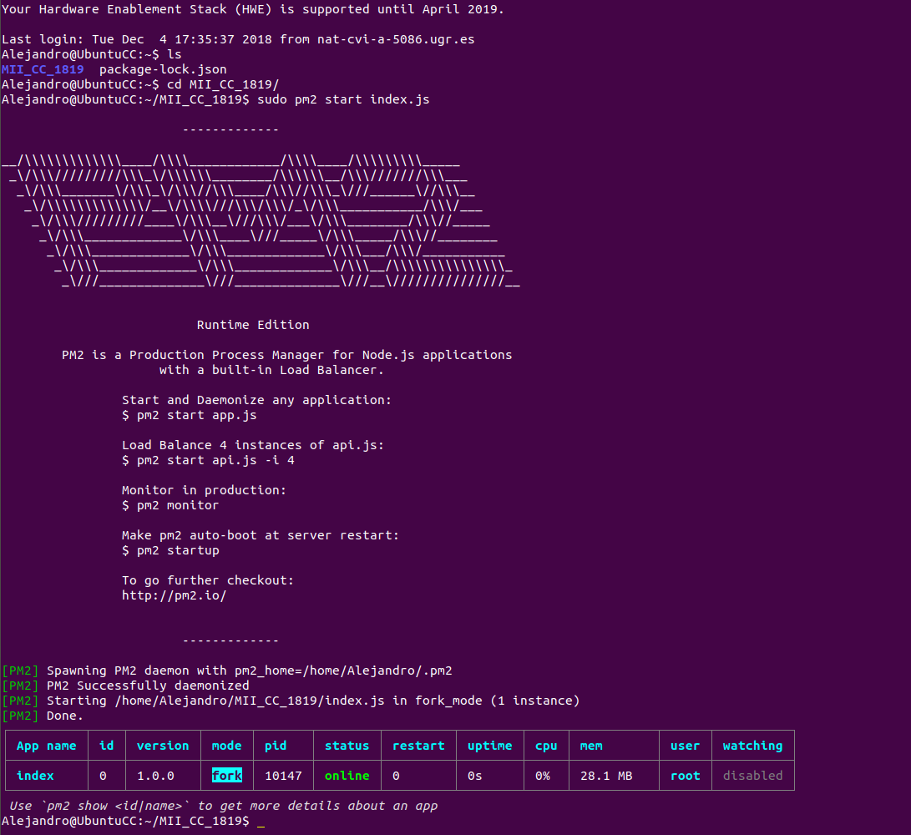
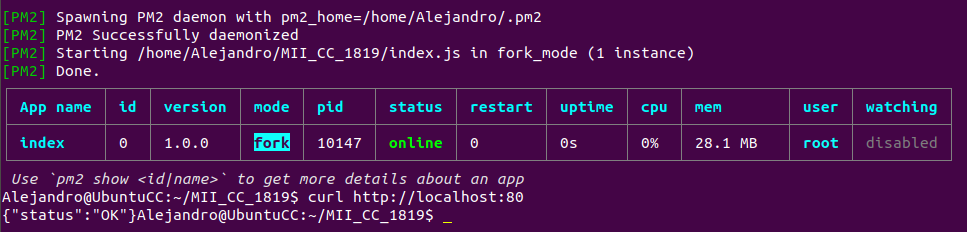

# Prueba de provisionamiento a Luis Gallego Quero en el hito 3 de Cloud Computing
---

**Autor**: [Alejandro Campoy Nieves](https://github.com/AlejandroCN7)

He realizado una prueba para comprobar si podía provisionar una de mis máquinas de Azure con el proyecto de Luis. Para ello lo primero que he hecho ha sido un fork a su repositorio. El siguiente paso ha sido hacer un clone de ese repositorio forkeado.

He buscado su carpeta [provision](https://github.com/AlejandroCN7/MII_CC_1819/tree/master/provision) localmente en mi ordenador. He entrado en ansible_hosts y he cambiado su ip a la de mi máquina en Azure. El siguiente paso ha sido ejecutar el playbook.yml con el comando `ansible-playbook playbook.yml` y ver que se me provisionaba todo correctamente.

El siguiente paso que he realizado ha sido acceder a la máquina virtual provisionada con el repositorio de Luis a través de SSH.

He ejecutado el siguiente comando para arrancar el servicio:

`Sudo pm2 start Index.ja`

Y me ha aparecido lo siguiente:

He probado con curl a realizar una petición GET en la dirección raíz y he obtenido el Status:OK.

Después me he ido al navegador y he realizado la misma petición. Pero esta vez utilizando la ip de la máquina virtual provisionada con su repositorio. El resultado ha sido satisfactorio por lo que demuestro que su servicio está corriendo bien en mi servidor.

