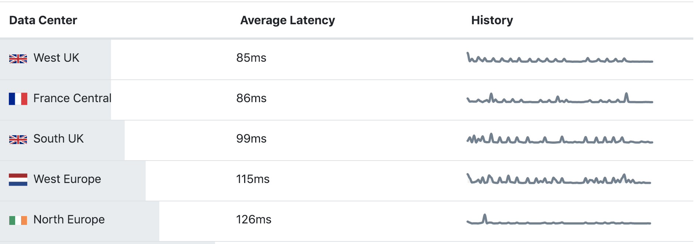
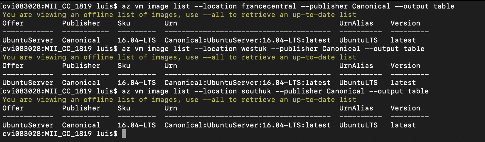
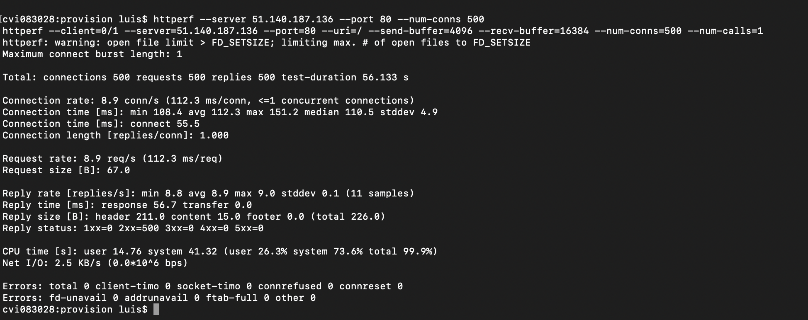

# Automatización de la creación de máquinas virtuales desde línea de órdenes

MV2: 51.140.14.158

En el presente documento vamos a exponer todos los pasos necesarios para poder crear instancias de máquinas virtuales en algún sistema cloud mediante el uso del cliente que nos proporcione para la línea de órdenes. 

Para ello, primeramente elegiremos un sistema cloud de los que encontramos en el mercado, y en función de ello, seleccionaremos la región para los recursos y las características que mejor se adapten a nuestro proyecto concreto.

## Sistema Cloud

El sistema cloud elegido ha sido Azure. Teníamos la posibilidad de trabajar también con otros como el proporcionado por Google o Amazon por ejemplo, pero finalmente nos decantamos por este por una razón básica, hay avances realizados para hitos siguientes, Vagrant, para el que ya se ha realizado una aproximación con dicho sistema Cloud. Además también fue utilizado anteriormente, y la falta de tiempo en general no nos permite explorar ahora otra opción como la de Google.

Para poder hacer uso de su cliente tan solo tenemos que hacer una instalación rápida por terminal y hacer login correctamente tal y como podemos ver [aquí](https://docs.microsoft.com/es-es/cli/azure/install-azure-cli-macos?view=azure-cli-latest).

## Región

Como podemos ver en el siguiente [enlace](https://azure.microsoft.com/es-es/global-infrastructure/regions/), encontramos diferentes regiones proporcionadas por *Azure*, aunque algunas no están disponibles. Para realizar un filtrado inicial vamos a utilizar [Azure Speed](https://azurespeedtest.azurewebsites.net/), en el que examinaremos la latencia de las regiones y nos quedaremos con las 3 mejores, para un posterior análisis. Tras un rato analizando, el resultado es el siguiente:

Una vez realizado este primer filtrado, las regiones que van a ser analizadas son:
- West UK
- France Central
- South UK

Ahora, vamos a crearnos un grupo de recursos para cada región, con su respectiva máquina virtual. Para que el test sea igual para cada región, vamos a buscar primero una imagen que esté disponible en ambas regiones. Para ajustar este filtrado lo restringiremos a un publisher concreto, Canonical.

Como podemos ver, UbuntuServer:16.04 será la imagen seleccionada para estos test iniciales. Además, mediremos lo que tarda cada grupo de recursos con su respectiva máquina en crearse mediante un script provisional de automatización.

Una vez creado cada grupo de recursos, haremos uso de [httperf](https://github.com/httperf/httperf) con el haremos un test de rendimiento a cada máquina concreta con nuestro proyecto desplegado. Los resultados finales los podemos ver en la siguiente tabla.

| Región | Latencia (ms) | Tiempo creación (s) | Ancho de banda (KB/s) | Tasa de respuesta (ms/respuesta) |
| -- | -- | -- | -- | -- |
| UK West | 85 | 143 | 2.4 | 117.8 |
| France Central | 86 | 142 | 2.3 | 121.4 |
| UK South | 99 | 142 | 2.5 | 112.3 |

En función de los resultados, tomando como especialmente relevante la tasa de respuesta, la región que mejores prestaciones nos ofrece ha sido *UK South*. A modo de ampliación podemos ver en la siguiente imagen la salida completa del test realizado por *httperf* en la imagen de esta región.

## Imagen

En general, cualquier distribución de *Linux* funciona bien con *Node.js*. Hay una denominada [Node-os](https://node-os.com/) especialmente dedicada al uso de Node.js pero no he encontrado una imagen de dicha distribución en las regiones más optimas para mi proyecto.

Por lo tanto, vamos ahora a presentar un test, como el realizado en el apartado anterior pero esta vez en una imagen *Debian*. Esto nos permitirá comparar con la Ubuntu y nos ayudará a decidir cual de las dos elegir.

| Imagen |  Tiempo creación (s) | Ancho de banda (KB/s) | Tasa de respuesta (ms/respuesta) |
| -- | -- | -- | -- | 
| UbuntuServer:16.04-LTS | 142 | 2.5 | 112.3 |
| Debian:8 | 172 | 2.4 | 117.1 |

Podemos ver la salida de *httperf* de esta última imagen.

Como vemos, la imagen de Ubuntu obtiene mejores resultados por lo que será la utilizada. Además, como para la región elegida solo tenemos disponible la 16.04 distribuida por Canonical, será la que utilizaremos en el proyecto.

Como *disco* que utilizaremos usaremos el de mínimo tamaño posible, ya que el proyecto aún ocupa muy poco espacio y además, como hacemos uso de almacén de base de datos *mlab*, apenas necesitaremos más espacio en el disco. Siendo este tamaño el denominado *A1_v2*.

### Script de automatización

Para la realización del despliegue de la máquina virtual en Azure hay que seguir 3 pasos principales:

- Crear el grupo de recursos, en el caso de que no lo asignemos a uno creado anteriormente. En nuestro script indicaremos que cree uno nuevo.
- Crear la máquina virtual indicando diferentes parámentros necesarios como por ejemplo el grupo de recursos al que va a ser asignado, nombre de la máquina, nombre de usuario, imagen concreta a usar y tamaño específico. También se pueden especificar algunos más, como el tipo de salida por ejemplo, o establecer directamente la IP a estática. Todo esto lo podemos ver en el enlace que añadiremos más abajo.
- Como último paso importante, hay que abrir el puerto 80 para hacer uso de Http. El 22, para ssh, viene abierto por defecto.

Para definir todo lo anterior en nuestro script, nos hemos basado en la guía que el propio azure proporciona. Esta la podemos encontrar [aquí](https://docs.microsoft.com/es-es/azure/virtual-machines/windows/quick-create-cli). Comentar, que como podrá ver en el script, se han añadido variables para definir el nombre de cada recurso. Además, se han añadido dos para poder medir el tiempo que tarda en desplegarse la máquina.

Finalmente, una vez ejecutado el script, ya tendremos nuestra máquina lista para terminar el aprovisionamiento mediante *Ansible*. A este le tendremos que indicar la IP de esta máquina y dejará listo nuestro proyecto para ejecutarlo. Como última anotación, se ha añadido al playbook la variable *remote_user*, necesaria para que *Ansible* conozca cual es el usuario para la conexión *ssh*.
