# Comprobación a **[@luiisgallego](https://github.com/luiisgallego/MII_CC_1819)** del Hito 5

**Comprobación realizada por Gema Correa ([@Gecofer](https://github.com/Gecofer/proyecto-CC))**

## Proceso de comprobación

En primer lugar se ha realizado un `fork` del repositorio y se ha clonado dicho fork a mi disco local.

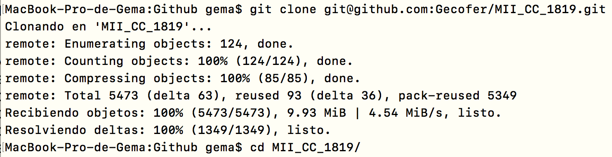

A continuación, nos situamos en el directorio de _orquestacion_ y lanzamos `vagrant up --no-parallel` para crear las dos máquinas virtuales. Podemos ver que la creación y el aprovisionamiento se ha realizado con éxito para la primera máquina.

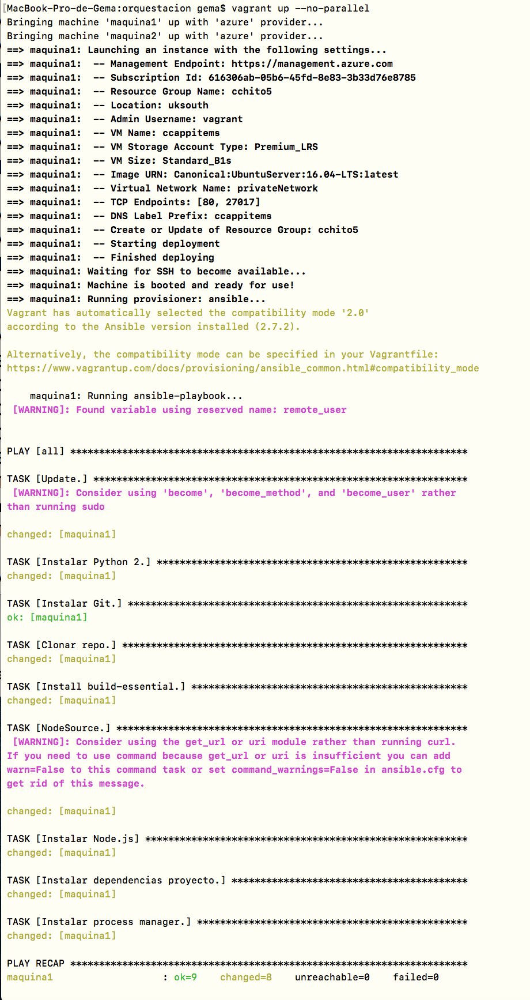

Podemos ver que la creación y el aprovisionamiento se ha realizado con éxito para la segunda máquina, también.

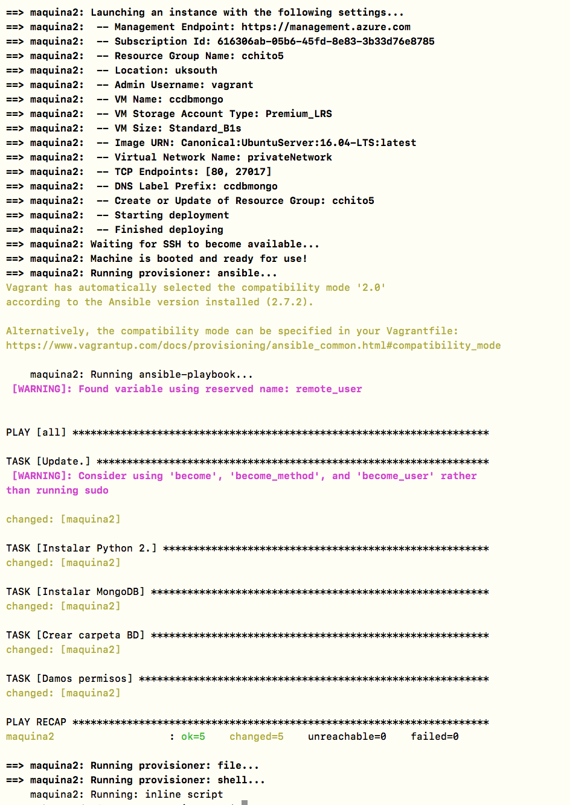

Una vez que tenemos ambas máquinas creadas, nos dirigimos a Azure, y comprobamos que efectivamente están.

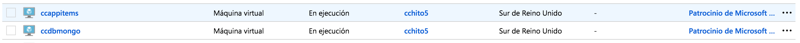

Accedemos a la máquina 2, la que dispone de la base de datos (mongo) con:

~~~
$ ssh vagrant@ccdbmongo.uksouth.cloudapp.azure.com
~~~

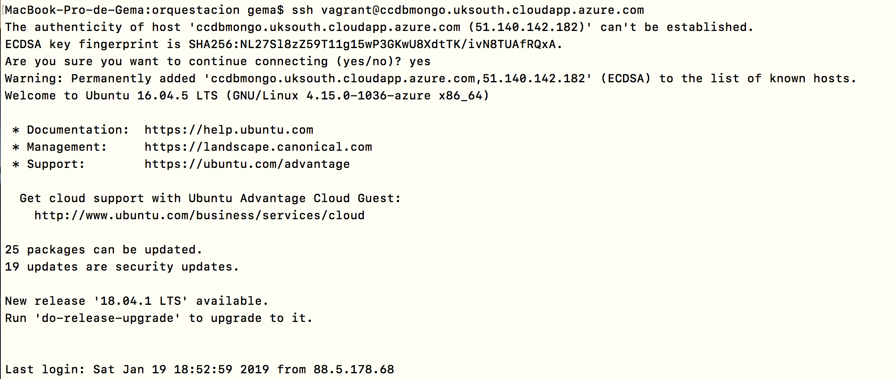

Y en dicha máquina lanzamos mongo (`sudo mongod`) y esperamos hasta que esté listo para escuchar (tarda unos minutos). Obtendremos una salida como la siguiente:

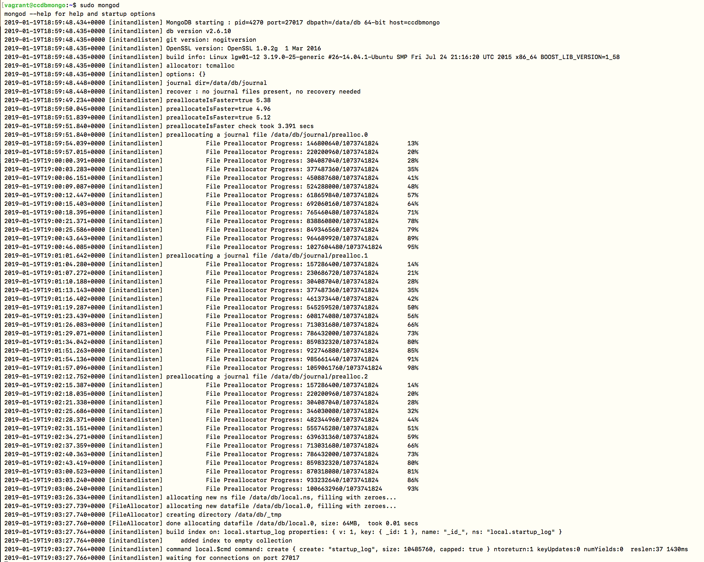

Una vez que tenemos la máquina funcionando, pasamos a la máquina principal, en donde accedemos con:

~~~
$ ssh vagrant@ccappitems.uksouth.cloudapp.azure.com
~~~

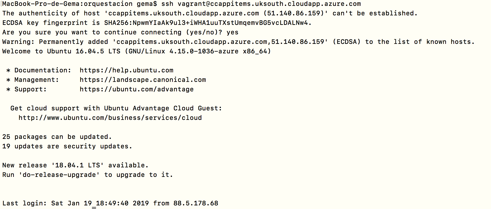

Una vez dentro de ella, ya solo nos queda lanzar el proyecto con `sudo npm start`:

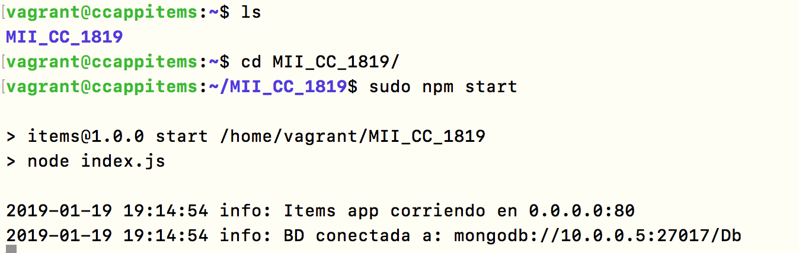

Obtenemos la IP de la máquina en Azure y comprobamos:

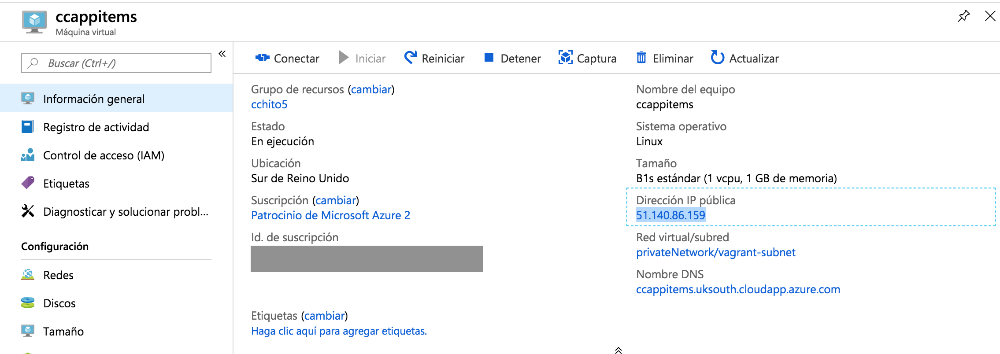

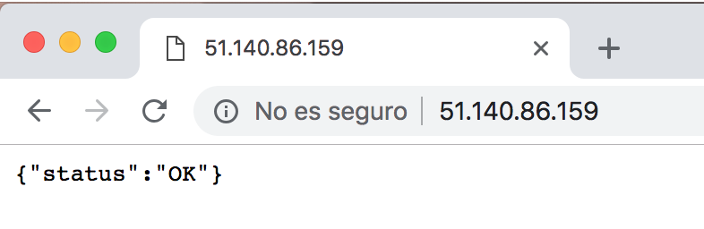
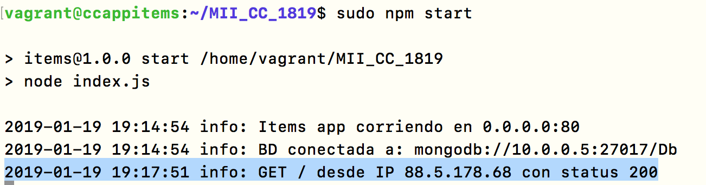

Entonces podemos concluir que **LA ORQUESTACIÓN DE MÁQUINAS VIRTUALES SE HA REALIZADO CON ÉXITO**.
