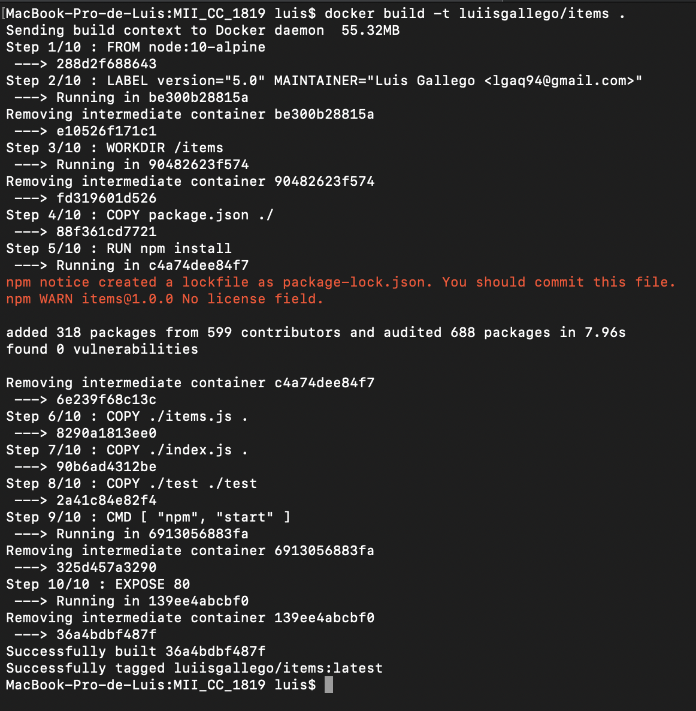

# Contenedores para despliegue en la nube

Como último hito nos enfrentamos al despligue mediante contenedores *Docker* de nuestra aplicación. Tras leer y comprender la documentación encontrada [aquí](http://jj.github.io/CC/documentos/temas/Contenedores) y realizados parte de los ejercicios que se proponían, los cuales podemos encontrar [aquí](https://github.com/luiisgallego/MII_CC_EJERCICIOS_1819/blob/master/Tema6/Documentacion.md), hemos pasado a definir nuestro propio *Dockerfile*.

A modo de unificar toda la funcionalidad de nuestra aplicación en un solo *Dockerfile*, principalmente en cuanto al servicio de base de datos, instalado en *MongoDB* en el anterior hito, se ha vuelto a utilizar bajo el servicio *mlab*. De esta forma, nuestro proyecto solo requiere de una imagen que, preferiblemente, tenga instalado *Node.js*.

Aclarado el anterior punto, ya podemos comenzar la definición del *Dockerfile*. 

## Dockerfile

En las siguientes lineas se justicará cada orden usada en nuestro archivo de *Docker*. La cuestión principal que surge es referente a que imagen usar. Como habíamos comentado anteriormente, la idea principal es usar una imagen que tenga *Node.js* por defecto. Esto lo podemos definir en el *Dockefile* mediante la instrucción FROM (FROM node:10-alpine). Como veremos más adelante, en las primeras pruebas se usó una imagen con *Node.js* que no era *alpine*, entonces el peso de dicha imagen era bastante elevado.

Posteriormente hemos definido la instrucción *LABEL* a modo informativo para indicar la versión de nuestro proyecto y el encargado de su creación mediante *MAINTAINER*. También hemos establecido el directorio donde trabajaremos, mediante la instrucción *WORKDIR*. Este directorio será el usado para copiar los archivos necesarios de nuestra aplicación, instalar dependencias y ejecutar dicha aplicación mediante *CMD*. Ahora, siguiendo las pautas que establece *Docker* y los requisitos de nuestra aplicación, es el momento de instalar las dependencias, para ello primero copiamos el archivo donde tenemos definidas las dependencias, *package.json* e instalamos haciendo uso de *RUN*. 

Una vez que nuestra imagen tiene todas las dependencias (Expres, Mongoose, Mocha, etc), podemos copiar los archivos mínimos para que nuestra aplicación funcione, incluso los test, esto se ha realizado mediante la instrucción *COPY* y haciendo uso del punto final establecemos que se copie en el directorio de trabajo creado previamente. Llegados a este punto ya estamos listos para ejecutar la aplicación, esto lo hacemos con la instrucción *CMD* a la que le indicamos la orden que venimos usando para lanzar la aplicación creada con *Node.js*. Como detalle importante, es necesario que podamos escuchar el puerto 80 exteriormente, esto lo conseguimos mediante *EXPOSE*. 

## Comparativa y uso

Una vez que nuestro *Dockerfile* está definido, pasamos a construir la imagen correspondiente. Como hemos comentado anteriormente, la primeras pruebas se realizaron con una imagen de *Node:10*. Una vez comprendida la filosofía de *Docker*, comenzamos a buscar imágenes más ligeras, decantándonos por la ofrecida por *alpine*. Por tanto, en la siguiente imagen podemos ver la construcción de esta, y en la posterior una comparativa de pesos según la informacion que nos ofrece *docker images*. Como veremos, la diferencia es bastante evidente, por lo que la elección de esta segunda imagen era más que clara. 

Tras la comparación, vamos a realizar una prueba de ejecución. Para ello nos crearemos un contenedor de la imagen alpine y comprobaremos que se está ejecutando según lo esperado.

Ahora que sabemos que la aplicación está ejecutandose correctamente en el contenedor, podemos realizar un PUT y comprobar el resultado, por ejemplo, en el navegador.

Tras las respectivas comprobaciones, ahora vamos a pasar a subir la imagen creada con nuestro *Dockerfile* a nuestro repositorio en *DockerHub*. El primer paso sería realizar un tag de la imagen, el cual no ha sido capturado. Finalmente, realizamos el push hacia el repositorio.

Para completar el despliegue correctamente tan solo nos falta desplegarlo en algún servicio cloud, una vez más, usaremos *Azure*. En esta ocasión, por simplificación, hemos hecho de su interfaz web, creándonos un grupo de recursos propio para este hito mediante *Instancias de contenedores* para alojar el contenedor de nuestro *DockerHub*. Una vez desplegado en *Azure*, comprobamos su correcto funcionamiento culminando el hito al que nos enfrentamos.

