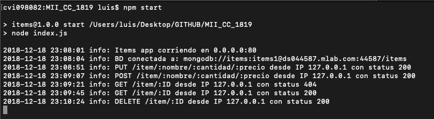
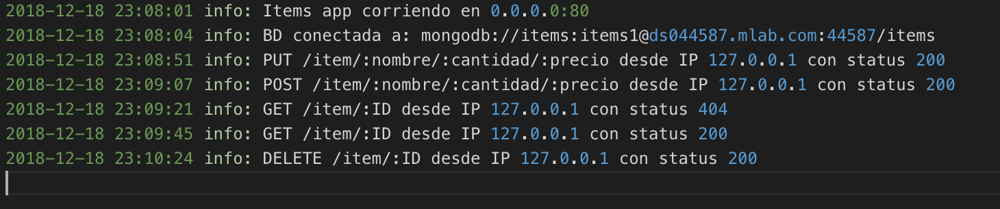

# Logs 

Llegados a este punto parece bastante claro que el tamaño y complejidad que suele tener los proyectos que desarrollamos es alto. En consecuencia, conforme avanza el desarrollo la cantidad de servicios que se despliegan en torno a la aplicación cada vez son más. Por tanto, hay que buscar alguna manera de porder obtener información de cada uno de ellos, su estado y los detalles importantes de su ejecución. Para el desarrollo de esta tarea haremos uso de los *logs*.

Para la gestión de dichos *logs* vamos a hacer uso de [winston](https://github.com/winstonjs/winston). Comentar que es una herramienta muy sencilla de configurar, con tan solo unas líneas la tenemos operativa. Además, ofrece gran capacidad de personalización, desde un uso base y rápido, hasta potentes logs con la creación de diferentes archivos, niveles, formatos y demás.

### Instalación

Como viene siendo costumbre en *Node.js*, hacemos uso de npm y con solo una orden conseguimos instalar la herramienta y almacenarla en las dependencias de nuestro *package.json*.

~~~
npm i winston --save
~~~

Llegados a este punto ya estamos listo para utilizar *winston* como sistema de *logs* en nuestra aplicación.

### Salida

Tal y como hemos comentado antes, la posibilidad de personalización a la hora de imprimir los logs es buena con *winstons*. En esta ocasion, no hemos profundizado en ello, limitandonos a configurar correctamente una salida lógica.

Esta salida esta formada por el dia y la hora, una etiqueta que representa el nivel donde nos encontramos y finalmente un texto que hemos definido en cada caso. Además, hemos definido dos salidas para cada log, una a un archivo concreto y otra por consola, quedando dichos *logs* de la siguiente manera.

