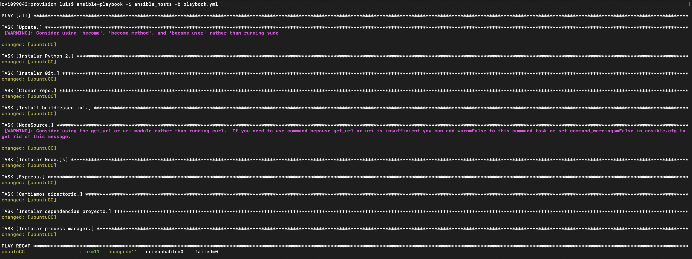
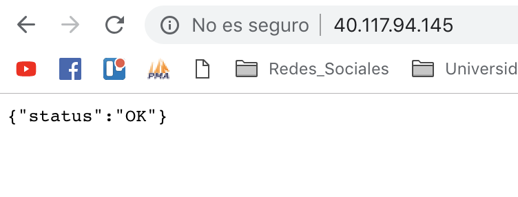

# Provision 

Dentro del ámbito del DevOps es común que trabajemos con diferentes máquinas virtuales en las que desplegaremos un mismo proyecto, en ocasiones con diferentes configuraciones del mismo. Para ello podemos usar una herramienta llamada *Ansible*, esta nos permite automatizar todo el aprovisionamiento de nuestro proyecto de una manera sencilla y cómodo.

Para dicho despliegue es necesario crear una receta en la que le indicaremos a *Ansible* cuales son los pasos que tiene que seguir para el correcto aprovisionamiento de nuestro proyecto. Esta receta esta basada en un formato de serialización de datos denominado *YAML*.

### Instrucciones

La configuración e instalación de *Ansible* es bastante sencilla, aunque para su correcto funcionamiento hay que seguir varios pasos claves:
- Modificacion del fichero *ansible_hosts*: En este tendremos que indicar a *Ansible* cual es la máquina o máquinas donde vamos a realizar el aprovisionamiento, utilizando para ello las IPs, puertos, nombre de usuario de la máquina virtual y clave privada de nuestra máquina anfitriona.
- Luego modificamos el fichero *ansible.cfg*: Aquí tenemos que indicar la ruta donde se encuentra nuestra clave para poder acceder por ssh.
- Llegado a este punto ya tenemos configurado completamente *Ansible*, y si hemos completado nuestro *playbook*, podemos lanzarlo a nuestra máquina virtual para que realice el aprovisionamiento con la siguiente instrucción:
~~~
ansible-playbook -i ansible_hosts -b playbook.yml
~~~

El resultado de la ejecución anterior lo podemos ver en la siguiente imagen:

### Provisión en Azure

MV: 40.117.94.145

Una vez que el provisionamiento ha funcionado correctamente en nuestras máquinas virtuales locales, llega el momento de desplegar en algún servicio de nube de los que encontramos en el mercado. Encontramos diferentes opciones, como *AWS de Amazon* o *Azure de Microsoft*, en nuestro caso hemos utilizado el segundo aprovechando la subscripción que disfrutamos.

Como primer paso, una vez dentro de la plataforma de *Azure*, tenemos que crearnos los recursos necesarios para nuestra máquina virtual. Nosotros de nuevo hemos utilizado el sistema operativo Ubuntu Server 14.04. Una vez creados los recursos necesarios, ya disponemos de todo lo necesario para realizar el provisionamiento en esta máquina. Para ello, debemos cambiar nuestro *ansible_hosts* con la IP de la máquina de *Azure* además de cambiar el nombre en función del proporcionado a esta nueva máquina.

Finalmente comentar que la captura anteriormente utilizada es la que corresponde al despliegue en *Azure*. Por último, una captura final del status OK desde el navegador:

### Comprobacion del provisionamiento de un compañero

Podemos ver el proceso realizado y el resultado [aquí](https://github.com/AlejandroCN7/Proyecto-Cloud-Computing/blob/master/docs/comprobacionProvision.md).

### Comprobación del provisionamiento por un compañero

Dicha comprobación ha sido realizada por @Alejandrocn7, y podemos consultarla [aquí](https://github.com/luiisgallego/MII_CC_1819/blob/master/provision/Prueba_Provision/Prueba_provisionamiento.md).